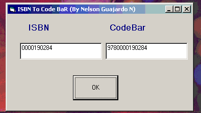



## ISBN TO CodeBAR

### Description

Converts your code ISBN to Code Bar.

Convierte tu codigo ISBN a Codigo de Barras.
 
### More Info
 

             |
---                |---
**Submitted On**   |2001-05-31 13:37:16
**By**             |[N/A](https://github.com/Planet-Source-Code/PSCIndex/blob/master/ByAuthor/empty.md)
**Level**          |Advanced
**User Rating**    |5.0 (15 globes from 3 users)
**Compatibility**  |VB 5\.0, VB 6\.0
**Category**       |[Databases/ Data Access/ DAO/ ADO](https://github.com/Planet-Source-Code/PSCIndex/blob/master/ByCategory/databases-data-access-dao-ado__1-6.md)
**World**          |[Visual Basic](https://github.com/Planet-Source-Code/PSCIndex/blob/master/ByWorld/visual-basic.md)
**Archive File**   |[ISBN TO Co203645312001\.zip](https://github.com/Planet-Source-Code/isbn-to-codebar__1-23650/archive/master.zip)

